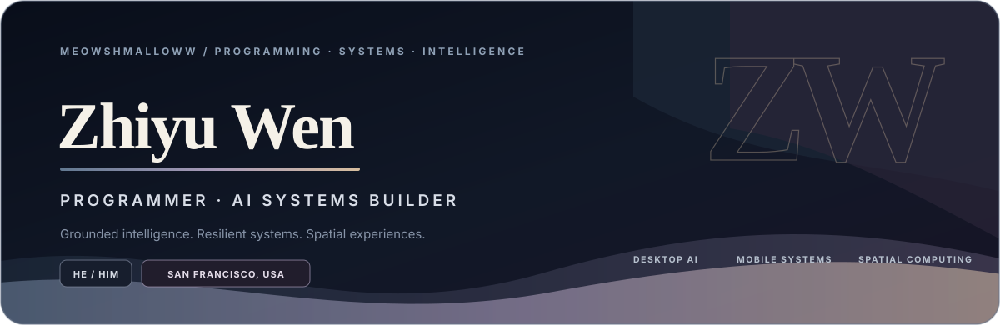
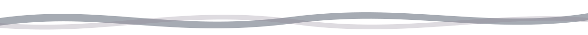
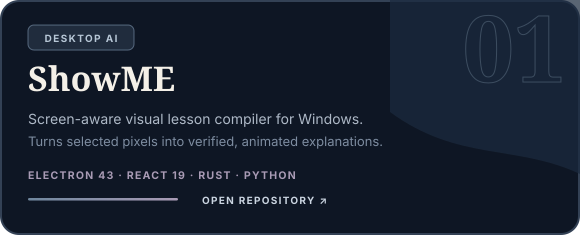
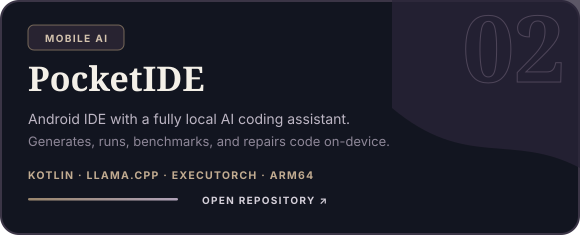
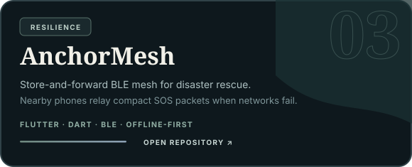
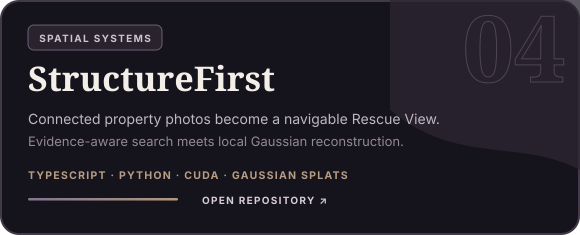
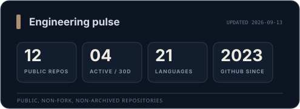
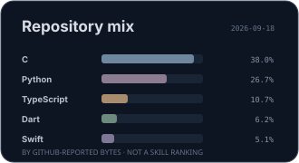
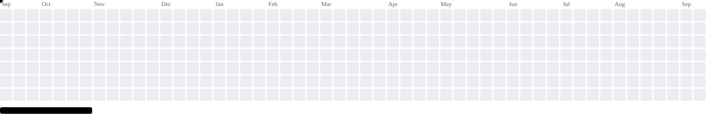

<!--
  GitHub profile for Zhiyu Wen — @meowshmalloww
  Visual direction: editorial midnight, matte gradients, flowing geometry.
  Motion intentionally avoids scanning lines, neon particles, and decorative dots.
-->

<div align="center">
  
</div>

<div align="center">
  
</div>

<div align="center">
  <a href="https://github.com/meowshmalloww"></a>
  <a href="https://www.linkedin.com/in/zhiyu-wen-b4a8b33a0/"></a>
  
  
  <a href="https://github.com/meowshmalloww?tab=repositories"></a>
  <a href="https://github.com/meowshmalloww?tab=followers"></a>
</div>

<div align="center">
  
</div>

## Hello — I’m Zhiyu.

I’m a programmer based in **San Francisco, USA**, working across **desktop AI**, **on-device intelligence**, **resilient mobile systems**, and **spatial computing**. I like projects where the interface is only the visible edge of a deeper technical system—and where ambitious ideas are backed by measurable evidence.

- **Grounded AI:** Structured outputs, verification gates, local inference, and interfaces that make model behavior understandable.
- **Resilient computing:** Offline-first mobile systems designed for unreliable networks and real-world constraints.
- **Spatial experiences:** Reconstruction pipelines that turn images and evidence into explorable 3D environments.
- **Native performance:** Rust, C/C++, ARM-aware optimization, and careful boundaries between product code and systems code.

## Selected builds

<p align="center">
  <a href="https://github.com/meowshmalloww/ShowME"></a>
  <a href="https://github.com/meowshmalloww/PocketIDE"></a>
</p>

<p align="center">
  <a href="https://github.com/meowshmalloww/AnchorMesh-mobile"></a>
  <a href="https://github.com/meowshmalloww/StructureFirst"></a>
</p>

<p align="center">
  <a href="https://github.com/meowshmalloww?tab=repositories"><strong>Explore all public repositories →</strong></a>
</p>

## Technical range

<div align="center">
  <a href="https://skillicons.dev">
    
  </a>
</div>

<br />

| Product layer | Systems layer | Intelligence layer |
| :-- | :-- | :-- |
| React, Next.js, Electron, Flutter | Kotlin, Rust, C/C++, BLE, SQLite | PyTorch, llama.cpp, ExecuTorch, multimodal APIs |
| Interfaces, accessibility, motion | Native workers, offline data, performance | Verification, reconstruction, local inference |

## Engineering pulse

<div align="center">
  
  
</div>

<sub>Language cards describe repository composition—not skill level. Public GitHub data is refreshed by the included workflow.</sub>

## Contribution arcade

<div align="center">
  <picture>
    <source media="(prefers-color-scheme: dark)" srcset="./assets/pacman-contribution-graph-dark.svg" />
    <source media="(prefers-color-scheme: light)" srcset="./assets/pacman-contribution-graph.svg" />
    
  </picture>
</div>

<p align="center"><em>Pac‑Man replays the last year of contributions. The board regenerates every day.</em></p>

<details>
  <summary><strong>Alternate arcade mode — Breakout</strong></summary>
  <br />
  <div align="center">
    <picture>
      <source media="(prefers-color-scheme: dark)" srcset="./assets/breakout-contribution-graph-dark.svg" />
      <source media="(prefers-color-scheme: light)" srcset="./assets/breakout-contribution-graph.svg" />
      
    </picture>
  </div>
</details>

## How I build

```text
01 / Find the real constraint before polishing the apparent problem.
02 / Keep model output behind explicit contracts and verification.
03 / Measure performance on the hardware people actually use.
04 / Design failure states as carefully as the ideal path.
05 / Leave behind evidence: tests, benchmarks, provenance, and clear docs.
```

<div align="center">
  <a href="https://github.com/meowshmalloww"><strong>See what I’m building now</strong></a>
</div>

<div align="center">
  
</div>
